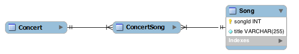

# Computer Science II
## Lab 6.0 - Structured Query Language I

An introduction to the Structured Query Language (SQL) used in databases.

This is a lab used in Computer Science II (CSCE 156, CSCE 156H) in the [Department of Computer Science & Engineering](https://cse.unl.edu) at the [University of Nebraska-Lincoln](https://unl.edu).

Chris Bourke wrote this lab, revamped by Sarah Roscoe for Summer 2021.

## Overview

### Resources

Prior to lab you should read/review the following resources.

-   Install MySQL Workbench on your own machine:  
    <https://www.mysql.com/products/workbench/>
    
-   Create a MySQL account by logging in here:
    <https://cse-apps.unl.edu/amu/login>

-   Change the account password using the following directions at:
    <http://cse.unl.edu/faq-section/unix-linux#node-302>

-   Review the supplemental SQL Cheat Sheet for the Album Database

-   This is a long lab but it can be completed if you prepare properly.
    Review the following materials:

    -   Information About Databases and Tables  
        <http://dev.mysql.com/doc/refman/5.6/en/getting-information.html>

    -   Connecting to MySQL from the command line:  
        <http://dev.mysql.com/doc/refman/5.6/en/connecting-disconnecting.html>

    -   Retrieving data  
        <http://www.w3schools.com/sql/sql_select.asp>

    -   Conditional clause  
        <http://www.w3schools.com/sql/sql_where.asp>

    -   Inserting data  
        <http://www.w3schools.com/sql/sql_insert.asp>

    -   Deleting data  
        <http://www.w3schools.com/sql/sql_delete.asp>

    -   Updating data  
        <http://www.w3schools.com/sql/sql_update.asp>

    -   `count()` aggregate function  
        <http://www.w3schools.com/sql/sql_func_count.asp>

    -   `max()` aggregate function  
        <http://www.w3schools.com/sql/sql_func_max.asp>

    -   `min()` aggregate function  
        <http://www.w3schools.com/sql/sql_func_min.asp>

    -   Joining tables inner join  
        <http://www.w3schools.com/sql/sql_join_inner.asp>

    -   left join  
        <http://www.w3schools.com/sql/sql_join_left.asp>

    -   right join  
        <http://www.w3schools.com/sql/sql_join_right.asp>
        
    -   Creating Tables:  
        <http://www.w3schools.com/sql/sql_create_table.asp>  
        <http://www.w3schools.com/sql/sql_autoincrement.asp>

    -   Types:  
        <http://www.w3schools.com/sql/sql_datatypes.asp>

    -   Primary Keys:  
        <http://www.w3schools.com/sql/sql_primarykey.asp>

    -   Foreign Keys:  
        <http://www.w3schools.com/sql/sql_foreignkey.asp>

    -   Altering Tables:  
        <http://www.w3schools.com/sql/sql_alter.asp>

    -   Constraints:  
        <http://www.w3schools.com/sql/sql_notnull.asp>  
        <http://www.w3schools.com/sql/sql_unique.asp>  
        <http://www.w3schools.com/sql/sql_default.asp>
        
### Lab Objectives & Topics

Following the lab, you should:

-   Connect to a database and execute queries

-   Perform basic Create, retrieve, update, and delete (CRUD) operations

-   Understand more complex queries using Joins and Aggregate functions

### Peer Programming Pair-Up

You may work on this lab with a partner or by yourself. Whichever you choose, you should submit your code to the corresponding Handin assignment. Handin link: https://cse-apps.unl.edu/handin

If you attend lab over Zoom, you may work in a a pair programming setup. At the start of each lab, you may be randomly paired up with another student by a lab instructor. One of you will be designated the driver and the other the navigator.

The navigator will be responsible for reading the instructions and telling the driver what is to be done. The driver will be in charge of the keyboard and workstation (on Zoom, this means the driver shares their screen). Both driver and navigator are responsible for suggesting fixes and solutions together. Neither the navigator nor the driver is "in charge." Beyond your immediate pairing, you are encouraged to help and interact and with other pairs in the lab.

Each week you should try to alternate: if you were a driver last week, be a navigator next, etc. Resolve any issues (you were both drivers last week) within your pair. Ask the lab instructor to resolve issues only when you cannot come to a consensus.

Because of the peer programming setup of labs, it is absolutely essential that you complete any pre-lab activities and familiarize yourself with the handouts prior to coming to lab. Failure to do so will negatively impact your ability to collaborate and work with others which may mean that you will not be able to complete the lab.

## 1. Getting Started

You can clone this project from GitHub, but this lab will not be using
the Eclipse IDE.  

## 2. Querying a Database 

You will be connecting to a remote SQL database server on CSE and
executing several queries. The queries you will be performing involve a
database that contains data about music albums, songs and the
artists involved. The structure of the database is illustrated in 
the following Entity-Relation (ER) Diagram.  
<p align="center">

</p>  

We have provided a supplemental SQL cheat sheet that you may reference
(see the files in the `documents` directory).  It contains many of 
the major types of queries along with examples using the Album database.

### 2.1 Creating the Database

You will need to "install" the Albums database and data into your own
database on CSE.  In this context, a "database" refers to a collection
of related tables and not the database server itself.  On the CSE 
database server you only have access to one actual database--the
database named after your CSE login.

1.  Open MySQL Workbench and connect to your CSE database by doing
    the following.
    
    1.  From the quick launch menu select "Open Connection to Start
        Querying"

    2.  Enter the host name (`cse.unl.edu`), username (your CSE login) and
        enter your sql password; click "OK"

2.  Open the `albumsDB.sql` file (or copy-paste its contents) into 
    Workbench.  Change the `LOGIN` to your own CSE login and execute
    the entire script.

## 3. Activities 

### 3.1 Executing Queries

We have provided a file, `albumQueries.sql` with a list of queries 
for you to write for the albums database.  Write your queries (and
be sure they work by executing them) in the same file.


### 3.2 Inserting & Manipulating Data

Data can be added to a database using `insert` queries and existing 
data in a database can be manipulated using `update` and `delete` 
queries. However, records in a table that may be referenced by records 
in other tables via a foreign key cannot be deleted unless the referencing 
records are handled first.  Likewise, data that requires a reference to 
data in other tables cannot be inserted prior to inserting the referenced 
records.

Write the following queries to manipulate data in the Albums database. Write your
queries in the provided `albumQueries.sql` file.

1. Choose your favorite album and insert it into the database by doing the
   following.
   1.  Write a query to insert the band of the album 
   2.  Write a query to insert the album 
   3.  Write two queries to insert the first two songs of the album
   4.  Write two queries to associate the two songs with the inserted album
2. Update the musician record for "P. Best", his first name should be "Pete".
3. Pete Best was the Beatle's original drummer, but was fired in 1962. 
   Write a query that removes Pete Best from the Beatles.
4. Attempt to delete the song "Big in Japan" (by Tom Waits on the album
   *Mule Variations*).  Observe that the query will fail due to referencing
   records. Write a series of queries that will allow you to delete the 
   album *Mule Variations*.

### 3.3 Altering a Database

New requirements may mean that the underlying data model must be modified 
to support new pieces of data. For example, if we wanted to keep track of 
the emails of each musician we could modify the `Musician` table to include 
an email address. SQL allows us to *alter* existing tables.  For example, the
following query will add a column to an existing table.

`alter table Musician add emailAddress varchar(50);`

However, this would mean that a musician could only ever have a single
email address (potentially violating first normal form).  A better solution 
would add support for multiple emails by adding an entirely new table.

```sql
create table Email (
  emailID int not null primary key auto_increment,
  musicianId int not null,
  address varchar(100) not null,
  foreign key `fk_email_to_musician` (musicianId) references Musician(musicianId)
);
```

You will modify the Albums database to add support for venues 
at which bands are under contract to play selected album songs. You will add 
tables and keys to this database to support this functionality

### 3.3.1 Designing Tables

Design comes before implementation.  Before we write SQL code to modify
our database, we'll first design the necessary tables.  Design entities 
and relation(s) to extend the albums database to support the following 
information about concerts.

-   The band playing at the concert

-   The band’s selected album songs to be played at the concert

-   The date the concert was held (Use an appropriately formatted `varchar`;
    date and time types are not generally cross-compatible in SQL).

-   The name of the venue where the concert was held

-   The number of seats at the venue

-   The number of concert tickets sold

Your solution may look something like the following (partial) ER Diagram.
<p align="center">

</p>  
The `Song` table is part of the original Albums database. Relationships 
between two entities are indicated by a line between the two entities. 
In general, these indicate a one-to-many relationship. The ER Diagram
suggests that you'll want to design a *many-to-many* relationship between
concerts and songs using a join table (`ConcertSong`) since bands tend
to play more than one song at a concert and perform more than one concert.
As you design your tables, think of the following.

*   What primary and foreign keys should be included and how should they
    relate records in each of the tables?
    
*   How should the `Band` table relate to the `Concert` and/or `ConcertSong`
    tables?

*   Every concert takes place at a *venue* (a physical location).  
    Good normalization would require yet another table(s) and a relationship
    that models the fact that a venue can have multiple concerts.  

Work out your diagram on a piece of paper or *whiteboard* it before proceeding.

### 3.3.2 Creating Tables

After designing your new tables and relations, you will write SQL code
to create them.  Place code to create your tables in the same `albumQueries.sql`
file.  Keep in mind the following design principles.  

-   Naming - Use a uniform naming conventions for the tables and their
    fields

-   Field Types - Make sure to use appropriate types and a uniform
    typing conventions for each field

-   Primary keys - Make sure to specify which fields are primary keys

-   Foreign keys - Enforce appropriate foreign key restrictions to
    reflect each relation.

### 3.3.3 Using the New Tables

Insert some test data to make sure your queries worked and that your
design makes sense.  Add these queries to your `albumQueries.sql` file.

1.  Write queries to insert at least two `Concert` records.

2.  Write queries to associate at least 2 songs with each of the two
    concerts

3.  Write a select-join query to retrieve these new results and produce
    a playlist for each concert


### 4. Testing, Submitting & Grading

* Be sure all of your queries run in Workbench
* ***Important***: Be sure to remove or comment out the `use LOGIN;`
  line in your script before submitting (the grader will be using
  its own database, not yours)
* Submit your completed `albumQueries.sql` file through webhandin.
* Run the grader and verify the output to complete your lab.

### Advanced Activity (Optional) 

1.  SQL supports basic arithmetic operations (`+, -, /, *, 5`) in its queries. Design
    an SQL query that calculates the total running time for a particular
    album (identified by AlbumID) by selecting two columns: minutes and
    seconds which both should be whole integers. Then create a query
    that returns the running time as a string in the format, “mm:ss”
    (hint/warning: string formatting is specific to particular databases
    and is not standard SQL; for MySQL see the `LPAD` and `CONCAT` functions).

2.  Read up on the syntax for creating a view–a stored query that
    creates a virtual table that can be queried as if it were an actual
    table in the database. Create a view in your album database to
    "flatten" the album and song data into one accessible table; include
    the following columns: `albumId, albumTitle, bandId, trackNumber, songId, songTitle`.
 
3. To practice connecting Java to an SQL database, see the optional lab at <https://github.com/sroscoe2/CSCE156-Lab06-JDBC>
    
